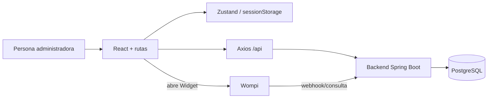

# Guía de entrevista: web de administración Lava Rápido Vehicular

> Las citas `archivo:línea` son relativas a `lava-rapido-admin/`. **No verificado** marca despliegues o conductas que estos archivos no demuestran. Las versiones de `package.json` son rangos declarados; `package-lock.json` fija las versiones instalables con `npm ci`.

## 1. Qué resuelve y con qué se comunica

Es la interfaz de administración para acceder al panel, consultar y gestionar reservas, vehículos, marcas, servicios y operadores, e iniciar/verificar pagos. Habla por HTTP con el backend Spring Boot a través de `/api`; nunca se conecta a PostgreSQL desde el navegador. Las rutas de panel están en `src/router/AppRouter.tsx:22-50`, y el cliente HTTP común en `src/services/api.ts:9-48`. La persistencia pertenece al backend y al repo de base de datos.

## 2. Stack y motivos

| Tecnología | Evidencia / versión declarada | Motivo |
| --- | --- | --- |
| React y React DOM | `^19.0.0`; `package.json:17-18` | Componentes e interfaz. Motivo de selección: **inferencia**. |
| TypeScript | `~5.6.0`; `package.json:33`, `tsconfig.app.json:2-24` | Contratos de datos y comprobación de tipos; **inferencia**. |
| Vite + plugin React | `^6.0.0`, `^4.3.0`; `package.json:31,34`, `vite.config.ts:1-15` | Servidor de desarrollo y bundle de producción; uso comprobado, motivo inferido. |
| React Router | `^7.1.0`; `package.json:20`, `src/router/AppRouter.tsx:1,24-50` | Navegación cliente y rutas anidadas; **inferencia**. |
| Axios | `^1.7.0`; `package.json:14`, `src/services/api.ts:1-19` | Llamadas HTTP e interceptores; **inferencia**. |
| Zustand | `^5.0.0`; `package.json:21`, `src/store/authStore.ts:1-2,38-65` | Estado global de autenticación; **inferencia**. |
| Leaflet/react-leaflet; lucide-react | `^1.9.4`, `^5.0.0`, `^1.31.0`; `package.json:15-16,19` | Mapas e iconos; **inferencia** apoyada por la ruta `maps` (`src/router/AppRouter.tsx:44`). |
| Vitest, Testing Library, jsdom | `^5.0.1`, rangos en `package.json:24-35`; `vitest.config.ts:5-14` | Pruebas de componentes y servicios; **inferencia**. |

`^`/`~` son rangos, no versiones exactas instaladas; para una cifra exacta se debe consultar la entrada respectiva de `package-lock.json` (por ejemplo `package-lock.json:2700` React, `3029` TypeScript, `3091` Vite, `3166` Vitest). No afirmar una razón histórica de elección porque no aparece documentada.

## 3. Arquitectura y responsabilidades

`src/main.tsx:11-19` monta React, contexto de tema y router. `src/router/AppRouter.tsx:27-49` separa landing/login/registro/reset públicas y dashboard protegido con páginas panel, servicios, turnos, vehículos, marcas, mapas, operadores, perfil y configuración. `src/features/auth/` contiene formularios y `authService`; `src/features/dashboard/pages/`, `components/`, `services/`, `hooks/` y `types` separan pantallas, piezas reutilizables, llamadas API, lógica del Widget y contratos. `src/services/api.ts:16-48` centraliza base URL, Bearer y errores 401/403. `src/store/authStore.ts:38-65` guarda token/usuario en `sessionStorage`, por pestaña; retira tokens legados de `localStorage` (`src/store/authStore.ts:21-23`). El contexto de tema se ve en `src/features/dashboard/pages/TurnosPage/TurnosPage.tsx:1-3,17-19`.

`RequireAdmin` consulta `/users/me` al entrar, permite solo `role === "ADMIN"`, redirige a acceso denegado o login y ofrece reintento si la API falla (`src/router/RequireAdmin.tsx:19-51`). Es una protección de interfaz; la autoridad final está en SecurityConfig/servicios del backend. El formulario de login decide el destino por rol y presenta mensajes diferentes para 401/5xx/conexión (`src/features/auth/components/LoginForm/LoginForm.tsx:38-65`).

## 4. Desarrollo, build y entrega

Desde esta carpeta, los scripts reales son `npm ci` para instalar según `package-lock.json`, `npm run dev` (Vite), `npm run typecheck`, `npm test`, `npm run build` y `npm run preview` (`package.json:6-11`; existencia de `package-lock.json`). `npm run build` ejecuta `tsc -b && vite build`, por lo que no se genera un bundle si falla TypeScript. El servidor dev usa puerto 5173 estricto y proxy `/api` hacia `http://127.0.0.1:8081` (`vite.config.ts:21-29`). El cliente usa ese proxy cuando la URL local apunta a 8081, evitando una llamada cruzada de origen (`src/services/api.ts:9-19`). El backend y BD deben estar levantados para flujos reales; `npm run dev` solo sirve el frontend.

El build de producción exige `VITE_API_URL` pública, HTTPS y terminada exactamente en `/api` (`vite.config.ts:5-13`). Vite genera archivos estáticos para servir desde un hosting web; el servidor de archivos, dominio, TLS, regla de fallback para `BrowserRouter` y pipeline de publicación **no están configurados en este repo**. No hay `Dockerfile` ni Compose en `lava-rapido-admin/` en la revisión. **Inferencia técnica:** la aplicación no requiere un contenedor para ejecutarse una vez compilada porque el navegador ejecuta HTML/JS/CSS; un contenedor Nginx u otro servidor sería una opción de empaquetado, no un requisito demostrado. La razón del equipo para no usarlo: **no verificada**. `npm run preview` es vista previa local del bundle, no evidencia de hosting productivo (`package.json:11`).

| Variable | Dónde y condición |
| --- | --- |
| `VITE_API_URL` | Única variable Vite expuesta aquí; `src/services/api.ts:9-19`, `.env.example:1-2`. En desarrollo hay fallback a `http://localhost:8081/api`; en build production es obligatoria y debe ser HTTPS `/api` (`vite.config.ts:5-13`). Es **pública** y queda embebida en el bundle: no poner secretos bajo `VITE_`. |

Los secretos de BD, JWT, SMTP y Wompi privados son del backend, no variables del navegador. La `publicKey` de Wompi llega en la respuesta de pago (`src/features/dashboard/services/pagoService.ts:6-16`). `APP_FRONTEND_URL` y `APP_CORS_ALLOWED_ORIGINS` se configuran en el backend para retorno y origen, no en este proyecto web; deben coincidir con el dominio real (**despliegue real no verificado**).

## 5. Flujos de extremo a extremo

**Login y permisos.** `LoginForm` valida presencia de correo/contraseña y envía `POST /users/login` (`src/features/auth/components/LoginForm/LoginForm.tsx:25-40`, `src/features/auth/services/authService.ts:10-13`). Axios usa `/api` por proxy local o `VITE_API_URL` en producción (`src/services/api.ts:9-19`). El backend busca `users`, verifica hash y rol/UUID admin y devuelve token+usuario; la web lo guarda por pestaña (`src/store/authStore.ts:44-52`). `RequireAdmin` reconsulta `/users/me` y solo monta panel si el backend devuelve ADMIN (`src/router/RequireAdmin.tsx:19-51`). Un 401 protegido limpia sesión, un 403 dispara evento (`src/services/api.ts:36-47`). Un fallo de login 401 se presenta como credenciales incorrectas, pero ese texto no identifica por sí solo si falló contraseña, estado o rol (`src/features/auth/components/LoginForm/LoginForm.tsx:56-63`).

**Crear reserva.** `TurnosPage` carga en paralelo reservas, vehículos y servicios disponibles (`src/features/dashboard/pages/TurnosPage/TurnosPage.tsx:20-24`). El formulario de reserva presencial selecciona vehículo/servicio/fecha/hora, comprueba horario y que el servicio termine antes de las 20:00, y llama a `crearReserva` (`src/features/dashboard/pages/TurnosPage/TurnosPage.tsx:30,37`). `reservaService` envía `POST /reservas` con `fkIdVehiculo`, `fkIdServicio`, `fechaReserva`, `horaReserva` (`src/features/dashboard/services/reservaService.ts:19`). Backend valida propiedad/estado, solapes y guarda reserva `PENDIENTE` con precio/duración pactados; PostgreSQL refuerza FK y exclusión horaria. La UI agrega la respuesta a la lista (`src/features/dashboard/pages/TurnosPage/TurnosPage.tsx:30`). Cambiar estado y cancelar usan `PATCH` (`src/features/dashboard/services/reservaService.ts:23-24`).

**Pagar reserva.** Cada fila pendiente muestra `CobrarReservaButton` (`src/features/dashboard/pages/TurnosPage/TurnosPage.tsx:35`), que llama a `iniciarPago` (`src/features/dashboard/components/CobrarReservaButton/CobrarReservaButton.tsx:207-234`, `src/features/dashboard/services/pagoService.ts:42-43`). El backend devuelve referencia, monto en centavos, moneda, llave pública y firma (`src/features/dashboard/services/pagoService.ts:6-16`); `useWompiWidget` carga el script remoto del Widget y lo abre (`src/features/dashboard/hooks/useWompiWidget.ts:3,59-85`). La web no toma el callback como prueba de pago: envía el ID de transacción para verificación servidor y consulta el estado (`src/features/dashboard/components/CobrarReservaButton/CobrarReservaButton.tsx:218-234`, `src/features/dashboard/pages/PagoResultadoPage/PagoResultadoPage.tsx:24-41`). El backend contrasta con Wompi y persiste `pagos`/`pago_intentos`; el webhook puede confirmar independientemente. Si se pierde el contexto de la pestaña, la página de resultado indica que no puede identificar la reserva (`src/features/dashboard/pages/PagoResultadoPage/PagoResultadoPage.tsx:39-46`). El botón de conciliación aparece solo a ADMIN cuando hay ID pendiente (`src/features/dashboard/components/CobrarReservaButton/CobrarReservaButton.tsx:294-295`), y el backend también lo restringe.

**Recuperación.** La web llama a `/auth/forgot-password` y `/auth/reset-password` (`src/features/auth/services/authService.ts:20-38`). El backend crea hash de token, manda un enlace por SMTP y, al regresar con token, valida caducidad/uso y actualiza contraseña en `users`. La respuesta genérica de solicitud no demuestra entrega de correo; depende del SMTP configurado en backend. La ruta de la web para reset está declarada (`src/router/AppRouter.tsx:29-31`).

**Operadores y catálogos.** `operadorService` llama a listar/crear/estado de operadores y crear asignaciones (`src/features/dashboard/services/operadorService.ts:37-50`); servicios, marcas y vehículos tienen módulos HTTP separados (`src/features/dashboard/services/servicioService.ts:5-40`, `src/features/dashboard/services/marcaService.ts:5-40`, `src/features/dashboard/services/vehiculoService.ts:5-30`). Las reglas definitivas residen en el backend y en las FK/UNIQUE de la BD.

## 6. Seguridad, errores, logs y pruebas

La web valida formularios para orientar al usuario, por ejemplo login y horario de reserva (`src/features/auth/components/LoginForm/LoginForm.tsx:25-34`, `src/features/dashboard/pages/TurnosPage/TurnosPage.tsx:30`); backend vuelve a validar. `RequireAdmin` oculta vistas no autorizadas, pero no sustituye autorización del servidor (`src/router/RequireAdmin.tsx:19-51`). Bearer JWT viaja en peticiones protegidas (`src/services/api.ts:20-34`); `sessionStorage` limita persistencia a la pestaña pero el token sigue siendo accesible a JavaScript, por lo que XSS es un riesgo inherente al diseño (**inferencia de seguridad**, `src/store/authStore.ts:40-60`). No se observó política CSP en archivos de entrega; **no verificado** si el host añade una. Los errores del servidor se muestran en Turnos y pagos; pago sin conexión permanece como pendiente hasta verificación (`src/features/dashboard/pages/TurnosPage/TurnosPage.tsx:15,22,30`, `src/features/dashboard/components/CobrarReservaButton/CobrarReservaButton.tsx:35-46`). No hay observabilidad centralizada de frontend configurada en este repo: **no verificado** externamente.

`vitest.config.ts:5-14` usa jsdom y setup. Hay pruebas de `TurnosPage`, `CobrarReservaButton`, `pagoService` y `useWompiWidget` (`src/features/dashboard/pages/TurnosPage/TurnosPage.test.tsx:1`, `src/features/dashboard/components/CobrarReservaButton/CobrarReservaButton.test.tsx:1`, `src/features/dashboard/services/pagoService.test.ts:1`, `src/features/dashboard/hooks/useWompiWidget.test.ts:1`), también hay pruebas de autenticación, rutas, seguridad HTTP, marcas y servicios (`src/features/auth/AuthValidation.test.tsx:1`, `src/router/RequireAdmin.test.tsx:1`, `src/services/apiSecurity.test.ts:1`, `src/features/dashboard/pages/MarcasPage/MarcasPage.test.tsx:1`, `src/features/dashboard/components/ServiciosTable/ServiciosTable.test.tsx:1`). Son pruebas locales con mocks, no demuestran cobros reales ni entrega SMTP. Comandos: `npm run typecheck`, `npm test`, `npm run build` (`package.json:6-11`).

## 7. Decisiones, ventajas, límites y mejoras

- **Ventaja:** un cliente Axios central hace consistente URL, JWT y respuesta 401/403 (`src/services/api.ts:9-48`).
- **Ventaja:** `/users/me` comprueba rol vigente al entrar al panel en vez de fiarse solo del rol almacenado (`src/router/RequireAdmin.tsx:19-33`).
- **Ventaja:** el pago requiere confirmación del backend, y la web distingue transacción Wompi de reserva (`src/features/dashboard/pages/PagoResultadoPage/PagoResultadoPage.tsx:24-46`).
- **Límite:** el build ata `VITE_API_URL` al bundle; cambiar backend puede requerir reconstruir artefactos (`vite.config.ts:5-13`, `src/services/api.ts:9-19`). Una configuración cargada en runtime sería alternativa; **inferencia**.
- **Límite:** el panel requiere una regla de fallback del host para rutas de `BrowserRouter`; no aparece configuración de host (**inferencia** basada en `src/router/AppRouter.tsx:24`).
- **Riesgo:** dependencia del script externo Wompi y de conectividad; la UI tiene reintento/estado de error (`src/features/dashboard/hooks/useWompiWidget.ts:59-85`, `src/features/dashboard/components/CobrarReservaButton/CobrarReservaButton.tsx:264`).
- **Mejora propuesta:** documentar despliegue estático real, dominio/CORS y prueba E2E de reserva y pago en sandbox; no se afirma que ya exista. El build verificado avisó que el bundle JS supera el umbral de 500 kB; dividir código por rutas sería una posible optimización, no un cambio implementado (`src/router/AppRouter.tsx:1-20`).

## Glosario

**SPA:** app de una página con navegación cliente. **Componente:** pieza de UI React. **Hook:** lógica reutilizable de React. **Store:** estado compartido Zustand. **DTO/contrato:** forma esperada del JSON. **Bearer JWT:** token en cabecera Authorization. **Proxy Vite:** reenvío local `/api` al backend. **Bundle:** JS/CSS estáticos de build. **CORS:** permiso del backend para origen web. **Widget:** ventana de pago Wompi. **Webhook:** notificación proveedor→backend. **Conciliación:** consulta servidor al proveedor para resolver estado.

## 22 preguntas probables de entrevista

1. **¿Qué framework web usan?** React `^19.0.0` declarado (`package.json:17-18`).
2. **¿Qué sirve desarrollo?** Vite en 5173 (`package.json:7`, `vite.config.ts:21-23`).
3. **¿Cómo se instala?** `npm ci` con `package-lock.json` y luego `npm run dev` (`package.json:6-11`).
4. **¿Qué hace build?** `tsc -b && vite build` (`package.json:8`).
5. **¿Dónde va la API local?** Proxy `/api` a 127.0.0.1:8081 (`vite.config.ts:24-29`).
6. **¿Cómo apunta a producción?** `VITE_API_URL` HTTPS acabada en `/api` (`vite.config.ts:5-13`).
7. **¿Es secreto `VITE_API_URL`?** No; es pública, `VITE_` queda en cliente (`.env.example:1-2`, `src/services/api.ts:9`).
8. **¿Cómo se navega?** `BrowserRouter` con rutas públicas y protegidas (`src/router/AppRouter.tsx:24-50`).
9. **¿Dónde se guarda JWT?** `sessionStorage`, vía Zustand (`src/store/authStore.ts:38-65`).
10. **¿Quién añade Bearer?** Interceptor Axios (`src/services/api.ts:20-34`).
11. **¿Qué hace un 401?** Limpia sesión y guarda destino (`src/services/api.ts:36-44`).
12. **¿Cómo se verifica ADMIN?** `GET /users/me` y rol ADMIN (`src/router/RequireAdmin.tsx:19-33`).
13. **¿Basta con ocultar una ruta?** No; el servidor aplica roles. La UI es defensa de experiencia, no autoridad (`src/router/RequireAdmin.tsx:19-51`).
14. **¿Qué campos envía una reserva?** Vehículo, servicio, fecha y hora (`src/features/dashboard/pages/TurnosPage/TurnosPage.tsx:30`).
15. **¿Dónde se valida horario?** En web antes de enviar y en backend antes de guardar (`src/features/dashboard/pages/TurnosPage/TurnosPage.tsx:30`).
16. **¿Qué endpoint crea reserva?** `POST /reservas` con base `/api` (`src/features/dashboard/services/reservaService.ts:19`, `src/services/api.ts:16-19`).
17. **¿Quién calcula el cobro?** Backend devuelve monto pactado y firma; la web no inventa importe (`src/features/dashboard/services/pagoService.ts:6-16`).
18. **¿Cómo se abre Wompi?** Script `widget.js` cargado por hook y botón de cobro (`src/features/dashboard/hooks/useWompiWidget.ts:3,59-85`, `src/features/dashboard/components/CobrarReservaButton/CobrarReservaButton.tsx:207-234`).
19. **¿El retorno Wompi confirma?** No; dispara verificación backend (`src/features/dashboard/pages/PagoResultadoPage/PagoResultadoPage.tsx:24-41`).
20. **¿Qué prueba el frontend?** Componentes/servicios con Vitest y jsdom; no un pago real (`vitest.config.ts:5-14`, `src/features/dashboard/services/pagoService.test.ts:1`).
21. **¿Necesita Docker?** No hay Dockerfile/Compose; build estático puede servirse sin contenedor. La decisión histórica no está documentada (**inferencia**, `package.json:8-11`).
22. **¿Qué falla si abro `/dashboard/turnos` directo en hosting?** Requiere fallback hacia `index.html` por `BrowserRouter`; configuración del host **no verificada** (`src/router/AppRouter.tsx:24,41`).

## Cómo explicaría este repositorio en 2 minutos

“Es una SPA de administración con React, TypeScript y Vite. Tiene rutas públicas de acceso y recuperación y un dashboard reservado a administradores. Un cliente Axios central comunica el panel con el backend: en desarrollo Vite manda `/api` a 8081 y en producción el build exige una URL HTTPS. Zustand mantiene el JWT por pestaña y, al entrar al panel, la web consulta `/users/me` para confirmar el rol. Los módulos permiten administrar catálogo, vehículos, operadores y reservas. Para pagar, abre el Widget Wompi con los datos que firma el backend y vuelve a consultar al servidor; el callback de navegador no equivale a pago aprobado. El build produce archivos estáticos y no hay configuración de contenedor o hosting en este repo; confirmaría con el equipo dónde se publica.” (`package.json:6-35`, `src/router/AppRouter.tsx:27-49`, `src/services/api.ts:9-48`, `src/router/RequireAdmin.tsx:19-51`, `src/features/dashboard/pages/PagoResultadoPage/PagoResultadoPage.tsx:24-46`).

## Preguntas difíciles que podrían hacerme

- **¿Dónde está desplegada?** El repo no contiene configuración de host ni contenedor: **no verificado**. Sí exige `VITE_API_URL` HTTPS al compilar (`vite.config.ts:5-13`).
- **¿Puede robarse el JWT con XSS?** Al estar en `sessionStorage`, JavaScript de la página puede leerlo; revisar CSP, sanitización y dependencias. Es un riesgo inferido del diseño (`src/store/authStore.ts:40-60`).
- **¿Puede la web marcar un pago aprobado?** No por sí sola: envía ID de transacción al backend y presenta el estado que este devuelve (`src/features/dashboard/pages/PagoResultadoPage/PagoResultadoPage.tsx:24-41`).
- **¿Qué pasa si `/users/me` falla por red?** `RequireAdmin` muestra una opción de reintento, sin dar acceso (`src/router/RequireAdmin.tsx:35-50`).
- **¿La prueba de Widget garantiza cobro real?** No; usa mocks y verifica integración de interfaz. Cobro de sandbox/producción debe comprobarse aparte (`src/features/dashboard/components/CobrarReservaButton/CobrarReservaButton.test.tsx:8-29`).
